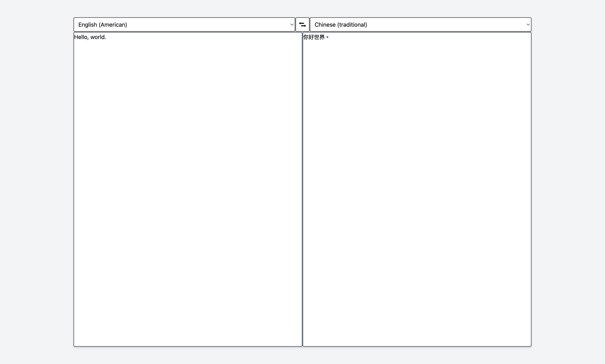

# DeepLX Web

This is a simple web translation application that uses the [DeepLX](https://deeplx.owo.network/) API to translate text between languages. It is built on [Fresh](https://fresh.deno.dev/) and [Deno](https://deno.land/), and deployed by [Deno Deploy](https://deno.com/deploy).
You can see the demo [here](https://lovesnowex-deeplx-web.deno.dev/).

